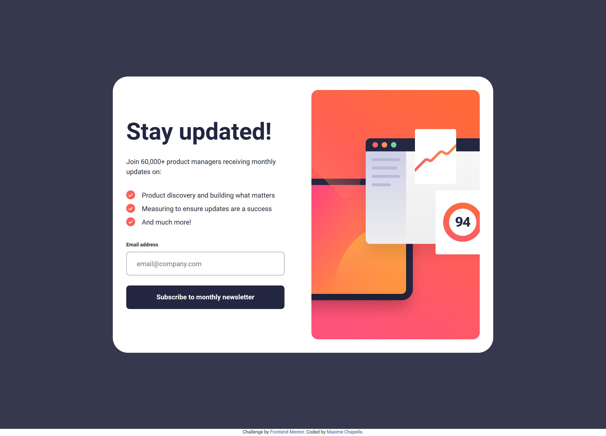

# Frontend Mentor - Newsletter sign-up form with success message solution

This is a solution to the [Newsletter sign-up form with success message challenge on Frontend Mentor](https://www.frontendmentor.io/challenges/newsletter-signup-form-with-success-message-3FC1AZbNrv).

## Table of contents

- [Overview](#overview)
  - [The challenge](#the-challenge)
  - [Screenshot](#screenshot)
  - [Links](#links)
- [My process](#my-process)
  - [Built with](#built-with)
  - [What I learned](#what-i-learned)
  - [Continued development](#continued-development)
  - [Useful resources](#useful-resources)
  - [AI Collaboration](#ai-collaboration)
- [Author](#author)

## Overview

### The challenge

Users should be able to:

- Add their email and submit the form
- See a success message with their email after successfully submitting the form
- See form validation messages if the field is left empty or the email address is not formatted correctly
- View the optimal layout depending on their device's screen size
- See hover and focus states for all interactive elements on the page

### Screenshot




### Links

- Live Site URL: [https://maxi1993-tech.github.io/newsletter-sign-up-form-with-success-message/](https://maxi1993-tech.github.io/newsletter-sign-up-form-with-success-message/)
- Solution URL: Add after submission

## My process

### Built with

Semantic HTML5, SCSS, Vanilla JavaScript, Flexbox, CSS Grid, mobile-first workflow

### What I learned

First real contact with JavaScript on this project. I learned how to target elements, listen to events, and manipulate classes to show/hide blocks. On the HTML side, I discovered `autocomplete="email"` to improve UX. And on the CSS side, `unset` to cancel a fixed width depending on the breakpoint.

```html
<input type="email" autocomplete="email" placeholder="email@company.com">
```

```js
form.addEventListener('submit', (event) => {
    event.preventDefault();
    const isValid = emailRegex.test(input.value);

    if (!isValid) {
        input.classList.add('form-input--error');
    } else {
        signUp.classList.add('hidden');
        success.classList.remove('hidden');
    }
});
```

### Continued development

JS is my priority right now, it's still my weak point. On the HTML/CSS side, I want to get better at handling components with multiple states: how to name classes, organize the code, and let the content decide the size instead of putting fixed widths everywhere.

### Useful resources

- [MDN Web Docs](https://developer.mozilla.org) - Used for addEventListener, regex and JS basics.
- [Medium](https://medium.com) - Complementary articles on JavaScript concepts.

### AI Collaboration

Used Claude as my main tutor on this project, especially for JavaScript. The code was built step by step with explanations at each stage. I couldn't have written the script alone at this point — that's an honest assessment for a first contact with JavaScript.

## Author

- Frontend Mentor - [@maxi1993-tech](https://www.frontendmentor.io/profile/maxi1993-tech)
- GitHub - [@maxi1993-tech](https://github.com/maxi1993-tech)